# Shopee - Best Price Guarantee Image Matching (Kaggle)


## 배경

> - 동남아시아 이커머스 Shopee는 다양한 상품 게시글 중에서 동일 상품 분류 희망
> - 최저가 서비스 제공을 위해 동일 상품 분류 모델 필요.
> - 상품 **`이미지`** 와 타이틀 **`텍스트`** 비교를 통해 동일상품 분류
> - Kaggle Competition (https://www.kaggle.com/c/shopee-product-matching/overview)


## 프로젝트 일정 및 기간

> - 전체 기간 : `2021.04.06~2021.04.27` (약 3주)
> - 일정
>   - `4/6 ~ 4/9` : 주제 선정 및 역할 분담, 일정 수립
>   - `4/12 ~ 4/16` : 데이터 분석 및 모델 구현
>   - `4/16` : 중간점검
>   - `4/19 ~ 4/23` : 머신러닝, 딥러닝 모델 수정, 점검 및 구현
>   - `4/26` : 최종 점검 및 전체 피드백
>   - `4/27` : 프로젝트 발표


## 기술 스택

> - Tensorflow2
> - Google Colab
> - AWS EC2
> - sklearn
> - Numpy & Pandas
> - NLTK


## 담당 역할

> - 팀장 역할
> - PPT 제작 및 발표
> - 자연어 처리 모델 구현
> - EDA


## 문제점

> - 텍스트 데이터 이해도 낮음
> - 자연어 처리 관련 머신러닝, 딥러닝 모델 이해도 낮음
> - 전체 데이터에서 유사한 것끼리 군집해야 하는 비지도학습 방식의 어려움


## 해결 방안

> - 자연어 처리 관련 책 3권 독학
> - Kaggle Shared Code 참고
> - KNN으로 접근하여 가까운 이웃끼리 하나의 동일상품으로 설정

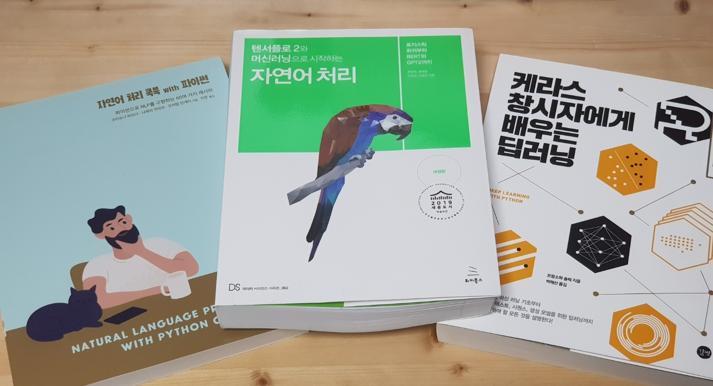


## 배운점

> - 이미지 phash data/ 텍스트 data/ 이미지 data EDA 방법
> - 저연어 처리를 위한 Token, Word Embedding, TFIDF, BERT 개념
> - 이미지 분류를 위한 EfficientNetB4 & ArcFace 모델
> - 전체 모델 파이프라인 빌드


## 수상

- 4팀 중 1등

_1%EC%A1%B0(%EC%88%98%EC%A0%95).JPG)


## WBS


## 모델 파이프라인

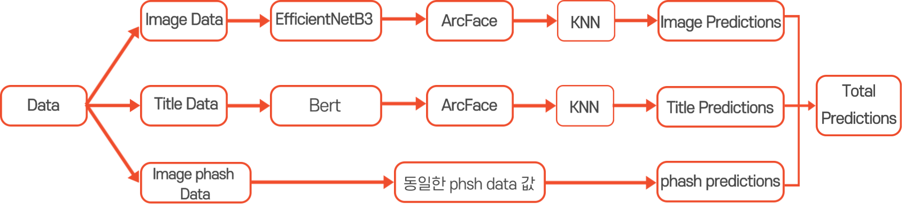


## Leaderboard Score

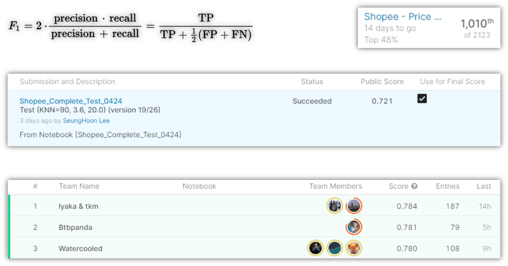


## EDA

> - `제공 Data`

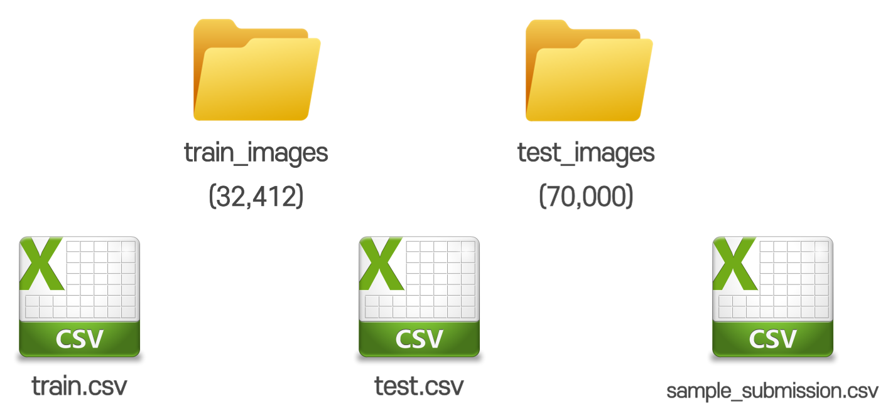


> - `train.csv Data`

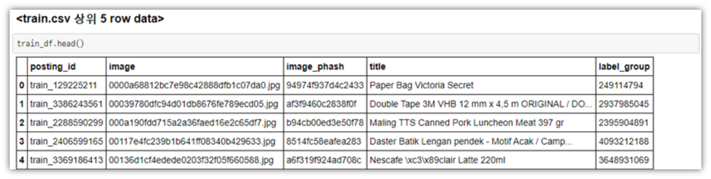

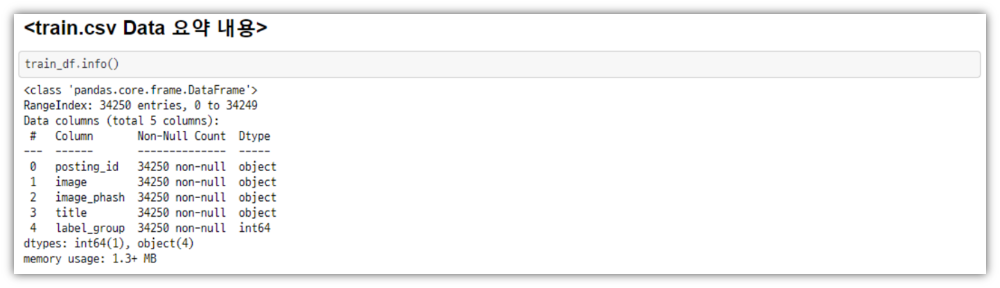

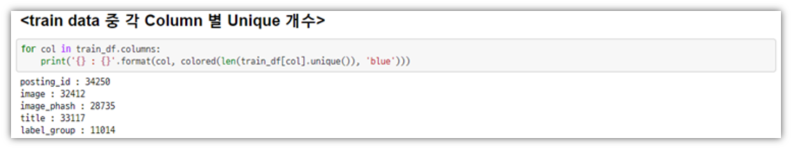


> - `train data image 확인하기`

  ```python
  def displayIMG(df, rows, cols, path, random):
      for row in range(rows):
          plt.figure(figsize=(20,5))
          
          for col in range(cols):
              if random :
                  r = np.random.randint(0, len(df))
              else:
                  r = cols*row + col
              
              img_name = df.iloc[r, 1]
              title = df.iloc[r, 3]
              
              title_with_return = ""
              for idx,word in enumerate(title):
                  title_with_return += word
                  if (idx!=0)&(idx%20==0): title_with_return += '\n'
              
              img_path = os.path.join(path, img_name)
              image = cv2.imread(img_path)
              
              plt.subplot(1, cols, col+1)
              plt.title(title_with_return)
              plt.axis('off')
              plt.imshow(image)
              
          plt.show()
          
  # (4X6) size Train Image 확인하기
  train_image_dir = './shopee-product-matching/train_images'
  displayIMG(train_df, 4, 6, train_image_dir, True)
  ```

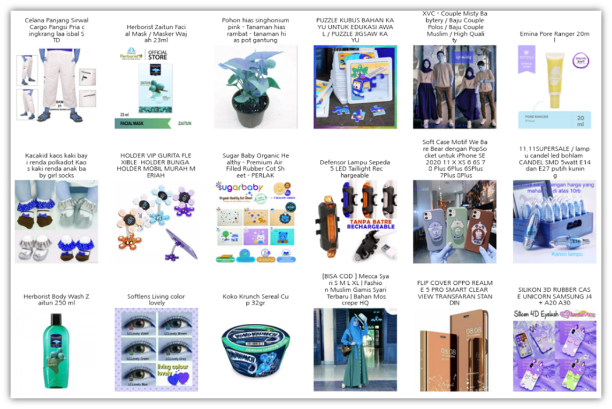


> - `동일상품 확인하기`

```python
# label_group Data 요약
# Top 50 동일상품 개수 막대 그래프

group = train_df.label_group.value_counts()
plt.figure(figsize=(20,10))
sns.barplot(group.index.values[:50].astype('str'), group.values[:50])
plt.xticks(rotation=75, size=14)
plt.rc('font', family='NanumGothic')
plt.ylabel('동일 상품 이미지 개수', size=18)
plt.xlabel('Label Group 숫자', size=18)
plt.title('Top 50 동일 상품 그룹', size=20)
plt.show()
```

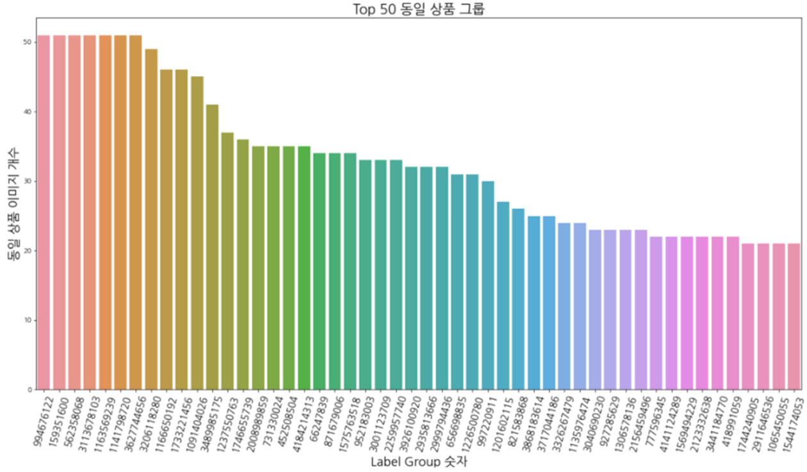


> - `동일상품 상품 이미지와 타이틀 확인하기`

```python
for i in range(2):
    image_df = train_df.loc[train_df.label_group == group.index[i]]
    displayIMG(image_df, 2,5, train_image_dir)    
```


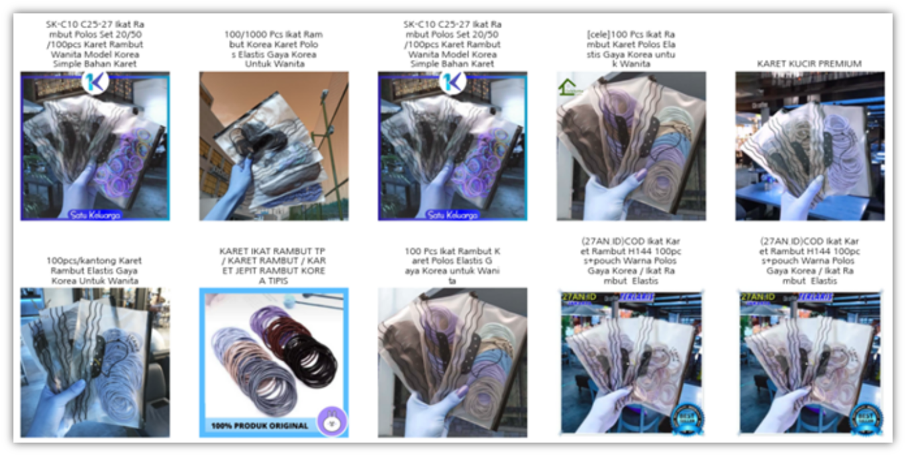


## 코드리뷰


> - 라이브러리

```python
# 파일 처리
import os

# Data 처리
import pandas as pd
import numpy as np

##############################################################

# RAPIDS 라이브러리
import cudf, cuml, cupy 
from cuml.feature_extraction.text import TfidfVectorizer
from cuml.neighbors import NearestNeighbors
##############################################################

# ML, DNN, CNN 관련 라이브러리
import tensorflow as tf
from tensorflow.keras.models import Model
from tensorflow.keras.layers import Layer, Input, GlobalAveragePooling2D, Softmax

#!pip install efficientnet
import efficientnet.tfkeras as efn
import math
##############################################################

# 이미지 및 그래프 출력
import cv2
import matplotlib.pyplot as plt
import seaborn as sns
import plotly.express as px

##############################################################

# 해쉬(phash) 값 처리
import imagehash

##############################################################

# Text Data NLP 처리
from sklearn.feature_extraction.text import TfidfVectorizer
from sklearn.neighbors import NearestNeighbors
import re
import nltk
nltk.download('popular')
nltk.download('stopwords')

from shutil import copyfile
copyfile(src = "../input/bert-baseline/tokenization.py", dst = "../working/tokenization.py")

import tokenization
import tensorflow_hub as hub

from sklearn.preprocessing import LabelEncoder
##############################################################

# 메모리 관리
import gc

# 경고메시지 지우기
import warnings
warnings.filterwarnings(action='ignore')

# 상태바 진행상태
from tqdm import tqdm

# Text Color
from termcolor import colored

# 실행시간 확인
import time
import datetime
```


> - `Title Text 전처리`

```python
# title 단어 preprocessing
def text_preprocessing(text, flg_stem, flg_lemm):
    
    stopwords_list = nltk.corpus.stopwords.words('english')
    
    # 특수기호 제거, 모든 문자 소문자로 바꾸기, 양옆 공백 제거
    text = re.sub(r'[^\w\s]', '', str(text).lower().strip())
    
    # text 문자에서 stopwords_list 에 있는 단어 제거하기
    text_list = text.split()
    
    if stopwords_list is not None :
        text_list = [word for word in text_list 
                    if word not in text_list]
        
    # -ing, -ly, ... 같은 접미어 제거 하기 (가지치기)
    if flg_stem == True :
        ps = nltk.stem.porter.PorterStemmer()
        text_list = [ps.stem(word) for word in text_list]
        
    # 뿌리 단어로 바꾸기
    if flg_lemm == True:
        lem = nltk.stem.wordnet.WordNetLemmatizer()
        text_list = [lem.lemmatize(word) for worf in text_list]
        
    # 문자열로 되돌려놓기
    clean_text = " ".join(text_list)
    return text


# Title preprocessing
train_df['clean_title'] = train_df['title'].map(lambda x : text_preprocessing(x, True, True))

# Clean_title 글자 개수(띄어쓰기 포함)
train_df['clean_title_len'] = train_df['clean_title'].map(lambda x: len(x))

# Clean_title 단어 개수
train_df['clean_title_word_count'] = train_df['clean_title'].map(lambda x: len(str(x).split(" ")))

# Clean_title 철자(스펠링) 개수(띄어쓰기 제외)
train_df['clean_title_char_count'] = train_df['clean_title'].map(lambda x: sum(len(word) for word in str(x).split(" ")))

# Clean_title 단어 대비 글자 개수
train_df['clean_title_avg_word_length'] = train_df['clean_title_char_count'] / train_df['clean_title_word_count']

train_df.iloc[:10,3:]
```

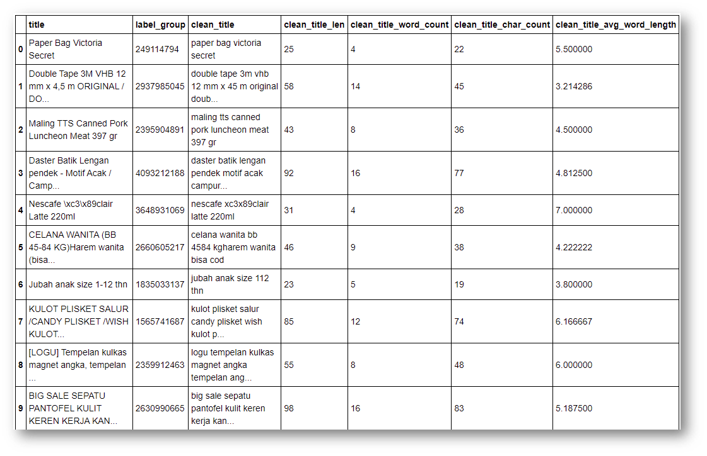

---


## Text Model

> - `BERT 활용 Text Embedding`

```python
# BERT encoding 함수
def bert_encode(texts, tokenizer, max_len=512):
    all_tokens = []   
    all_masks = []    
    all_segments = [] 
    
    for text in texts:
        text = tokenizer.tokenize(text)
        text = text[:max_len-2]
        input_sequence = ["[CLS]"] + text + ["[SEP]"]
        pad_len = max_len - len(input_sequence)
        
        tokens = tokenizer.convert_tokens_to_ids(input_sequence)
        tokens += [0] * pad_len
        pad_masks = [1] * len(input_sequence) + [0] * pad_len
        segment_ids = [0] * max_len
        
        all_tokens.append(tokens)
        all_masks.append(pad_masks)
        all_segments.append(segment_ids)
        
    gc.collect()
    
    return np.array(all_tokens), np.array(all_masks), np.array(all_segments)

# BERT Model 전이학습 함수
def get_text_embeddings(df, max_len = 70):
    embeds = []
    module_url = "../input/external-model/bert_en_uncased_L-24_H-1024_A-16_1"
    bert_layer = hub.KerasLayer(module_url, trainable = True)
    vocab_file = bert_layer.resolved_object.vocab_file.asset_path.numpy()
    do_lower_case = bert_layer.resolved_object.do_lower_case.numpy()
    tokenizer = tokenization.FullTokenizer(vocab_file, do_lower_case)
    
    text = bert_encode(df['title'].values, tokenizer, max_len = max_len)
    
    margin = ArcMarginProduct(
            n_classes = 11014, 
            s = 30, 
            m = 0.5, 
            name='head/arc_margin', 
            dtype='float32'
            )
    
    input_word_ids = Input(shape=(max_len,), dtype=tf.int32, name="input_word_ids")
    input_mask = Input(shape=(max_len,), dtype=tf.int32, name="input_mask")
    segment_ids = Input(shape=(max_len,), dtype=tf.int32, name="segment_ids")
    label = Input(shape = (), name = 'label')
    
    _, sequence_output = bert_layer([input_word_ids, input_mask, segment_ids])
    clf_output = sequence_output[:, 0, :]
    
    x = margin([clf_output, label])
    output = Softmax(dtype='float32')(x)
    
    model = Model(inputs = [input_word_ids, input_mask, segment_ids, label], 
                  outputs = [output])
    model.load_weights('../input/bert-baseline/Bert_123.h5')
    
    model = Model(inputs = model.input[0:3], outputs = model.layers[-4].output)
    
    chunk = 5000
    iterator = np.arange(np.ceil(len(df) / chunk))
    for j in iterator:
        
        a = int(j * chunk)
        b = int((j + 1) * chunk)

        text_chunk = ((text[0][a:b], text[1][a:b], text[2][a:b]))
        
        text_embeddings = model.predict(text_chunk, batch_size = BATCH_SIZE)
        embeds.append(text_embeddings)
        
    del model
    
    text_embeddings = np.concatenate(embeds)
    
    del embeds
    gc.collect()
    
    return text_embeddings
```


> - `ArcFace`

```python
# ArcFace loss 생성 Class
class ArcMarginProduct(Layer):
    '''
    GDis(Geodestic Distance margin) 구하는 Class
    Implements large margin arc distance.
    '''
    
    def __init__(self, n_classes, s=30, m=0.5, easy_margin=False, ls_eps=0.0, **kwargs):
        
        super(ArcMarginProduct, self).__init__(**kwargs)
        
        self.n_classes = n_classes
        self.s = s
        self.m = m
        self.ls_eps = ls_eps
        self.easy_margin = easy_margin
        self.cos_m =tf.math.cos(m)
        self.sin_m =tf.math.sin(m)
        self.th = tf.math.cos(math.pi - m)
        self.mm = tf.math.sin(math.pi - m) * m
        
    def get_config(self):
        config = super().get_config().copy()
        config.update({
            'n_classes':self.n_classes,
            's' : self.s,
            'm' : self.m,
            'ls_eps' : self.ls_eps,
            'easy_margin' : self.easy_margin
        })
        return config
    
    def build(self, input_shape):
        super(ArcMarginProduct, self).build(input_shape[0])
        
        self.W = self.add_weight(
            name='W',
            shape=(int(input_shape[0][-1]), self.n_classes),
            initializer = 'glorot_uniform',
            dtype='float32',
            trainable=True,
            regularizer=None
            )
        
    def call(self, inputs):
        X, y = inputs
        y = tf.cast(y, dtype=tf.int32)
        cosine = tf.matmul(
            tf.math.l2_normalize(X, axis=1),
            tf.math.l2_normalize(self.W, axis=0)
        )
        sine = tf.math.sqrt(1.0 - tf.math.pow(cosine, 2))
        phi = cosine * self.cos_m - sine * self.sin_m
        
        if self.easy_margin:
            phi = tf.where(cosine > 0, phi, cosine)
        else:
            phi = tf.where(cosine > self.th, phi, cosine - self.mm)
            
        one_hot = tf.cast(
            tf.one_hot(y, depth=self.n_classes),
            dtype=cosine.dtype
        )
        
        if self.ls_eps > 0:
            one_hot = (1-self.ls_eps) * one_hot + self.ls_eps / self.n_classes
            
        output = (one_hot * phi) + ((1.0 - one_hot) * cosine)
        output *= self.s
        return output
```


---


## Image Model

> - `Image Embedding Code`

```python
# read & decode image
def read_and_decode_img(image):
    image = tf.io.read_file(image)
    img = tf.image.decode_jpeg(image, channels=3)
    img = tf.image.resize(img, IMG_SIZE)
    img = tf.cast(img, tf.float32) / 255.0
    return img

# dataset load
def get_dataset(image):
    dataset = tf.data.Dataset.from_tensor_slices(image)
    dataset = dataset.map(read_and_decode_img, 
                          num_parallel_calls = tf.data.experimental.AUTOTUNE)
    dataset = dataset.batch(BATCH_SIZE)
    dataset = dataset.prefetch(tf.data.experimental.AUTOTUNE)
    return dataset

# image embedding
def image_embedding(img_path):
    embeds = []
    
    margin = ArcMarginProduct(
            n_classes = N_CLASSES, 
            s = 30, 
            m = 0.5, 
            name='head/arc_margin', 
            dtype='float32'
            )
    
    input_layer = Input(shape = (*IMG_SIZE, 3))
    label = Input(shape= ())
    
    x = efn.EfficientNetB3(weights = None, include_top=False)(input_layer)
    x = GlobalAveragePooling2D()(x)
    x = margin([x, label])
    
    output_layer = Softmax(dtype='float32')(x)
    
    model = Model(inputs=[input_layer, label], 
                  outputs=[output_layer])
    model.load_weights('../input/shopeeefficientnetb3512/EfficientNetB3_512_42.h5')
    model = Model(inputs = model.input[0], 
                  outputs = model.layers[-4].output)
    chunk = 5000
    iterator = np.arange(np.ceil(len(df) / chunk))
    for j in iterator:
        a = int(j * chunk)
        b = int((j + 1) * chunk)
        image_dataset = get_dataset(img_path[a:b])
        image_embeddings = model.predict(image_dataset)
        embeds.append(image_embeddings)
    
    del model
    
    image_embeddings = np.concatenate(embeds)
    
    del embeds
    gc.collect()
    
    return image_embeddings
```


## KNN

```python
# KNN 이웃 구하기
def get_neighbors(df, embeddings, KNN=50, image=True):
    model = NearestNeighbors(n_neighbors=KNN)
    model.fit(embeddings)
    distances, indices = model.kneighbors(embeddings)
    
    if GET_CV:
        if image :
            thresholds = list(np.arange(3.0, 5.0, 0.1))
        else:
            thresholds = list(np.arange(15, 35, 1))
            
        scores = []
        for threshold in thresholds:
            predictions = []
            for k in range(embeddings.shape[0]):
                idx = np.where(distances[k,] < threshold)[0]
                indc = indices[k , idx]
                posting_ids = ' '.join(df['posting_id'].iloc[indc].values)
                predictions.append(posting_ids)
            df['pred_matches'] = predictions
            df['f1'] = f1_score(df['matches'], df['pred_matches'])
            score = df['f1'].mean()
            
            print('F1 score for threshold {} is {}'.format(threshold, score))
            scores.append(score)
            
        thresholds_scores = pd.DataFrame({
            'thresholds':thresholds,
            'scores': scores
        })
        max_score = thresholds_scores[thresholds_scores['scores'] == thresholds_scores['scores'].max()]
        best_threshold = max_score['thresholds'].values[0]
        best_score = max_score['scores'].values[0]
        
        print('Our best score : {} , threshold : {}'.format(best_score, best_threshold))
        print(type(best_threshold))
        
        del predictions, scores, indc, idx
        
        
        predictions = []
        for i in range(embeddings.shape[0]):
            if image:
                idx = np.where(distances[i,]<best_threshold)[0]
            else:
                idx = np.where(distances[i,]<best_threshold)[0]
                
            indc = indices[i, idx]
            posting_ids = df['posting_id'].iloc[indc].values
            predictions.append(posting_ids)
        
    else:
        
        predictions = []
        for k in tqdm(range(embeddings.shape[0])):
            if image:
                idx = np.where(distances[k,]<3.6)[0]
            else:
                idx = np.where(distances[k,]<20.0)[0]
            indc = indices[k, idx]
            posting_ids =df['posting_id'].iloc[indc].values
            predictions.append(posting_ids)
            
    del model, distances, indices, idx, indc, posting_ids
    gc.collect()
    
    return df, predictions
```


## F1 Score

```python
def f1_score(t_true, t_pred):
    t_true = t_true.apply(lambda x : set(x.split()))
    t_pred = t_pred.apply(lambda x : set(x.split()))
    
    intersection = np.array([len(x[0] & x[1]) for x in zip(t_true, t_pred)])
    len_t_true = t_true.apply(lambda x : len(x)).values
    len_t_pred = t_pred.apply(lambda x : len(x)).values
    
    F1 = 2 * intersection / (len_t_true + len_t_pred)
    
    return F1
```


## 예측값 결합

```python
def combine_preds(row):
    x = np.concatenate([row['image_pred'], row['text_pred'], row['phash_pred']])
    return ' '.join(np.unique(x))

if GET_CV:
    df['image_pred'] = image_predictions
    df['text_pred'] = text_predictions
    df['pred_matches'] = df.apply(combine_preds, axis = 1)
    df['f1'] = f1_score(df['matches'], df['pred_matches'])
    score = df.f1.mean()
    print('Final F1 CV Score :', score)
    df['matches'] = df['pred_matches']
    df[['posting_id', 'matches']].to_csv('submission.csv', index = False)
else:
    df['image_pred'] = image_predictions
    df['text_pred'] = text_predictions
    df['matches'] = df.apply(combine_preds, axis = 1)
    df[['posting_id', 'matches']].to_csv('submission.csv', index = False)
```

